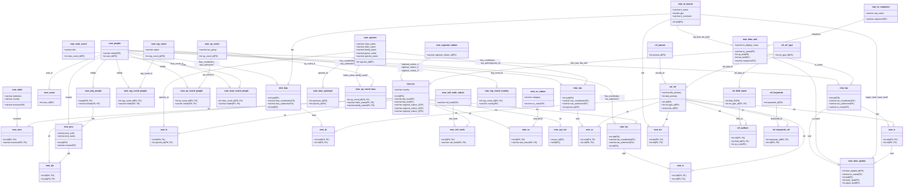

```mermaid
classDiagram
    com_mlist --|> now_mus : museum
    com_people --|> com_users : user_id
    com_people --|> now_bau : "bau_coordinator, bau_authorizer"
    com_people --|> now_lau : "lau_coordinator, lau_authorizer"
    com_people --|> now_proj : contact
    com_people --|> now_proj_people : initials
    com_people --|> now_reg_coord_people : initials
    com_people --|> now_sau : "sau_coordinator, sau_authorizer"
    com_people --|> now_sp_coord_people : initials
    com_people --|> now_strat_coord_people : initials
    com_people --|> now_tau : "tau_coordinator, tau_authorizer"
    com_species --|> com_taxa_synonym : species_id
    com_species --|> now_ls : species_id
    com_species --|> now_sau : species_id
    com_species --|> now_sp_coord_taxa : "order_name, family_name"
    now_bau --|> now_br : buid
    now_coll_meth_values --|> now_coll_meth : coll_meth
    now_lau --|> now_lr : luid
    now_loc --|> now_coll_meth : lid
    now_loc --|> now_lau : lid
    now_loc --|> now_ls : lid
    now_loc --|> now_mus : lid
    now_loc --|> now_plr : lid
    now_loc --|> now_ss : lid
    now_loc --|> now_syn_loc : lid
    now_proj --|> now_plr : pid
    now_proj_people --|> now_proj : pid
    now_regional_culture --|> now_loc : "regional_culture_1, regional_culture_2, regional_culture_3"
    now_reg_coord --|> now_reg_coord_country : reg_coord_id
    now_reg_coord --|> now_reg_coord_people : reg_coord_id
    now_sau --|> now_sr : suid
    now_ss_values --|> now_ss : sed_struct
    now_sp_coord --|> now_sp_coord_people : sp_coord_id
    now_sp_coord --|> now_sp_coord_taxa : sp_coord_id
    now_strat_coord --|> now_strat_coord_people : strat_coord_id
    now_tau --|> now_time_update : tuid
    now_tau --|> now_tr : tuid
    now_time_unit --|> now_loc : "bfa_max, bfa_min"
    now_time_unit --|> now_tau : tu_name
    now_time_unit --|> now_time_update : tu_name
    now_tu_bound --|> now_bau : bid
    now_tu_bound --|> now_time_unit : "up_bnd, low_bnd"
    now_tu_bound --|> now_time_update : "upper_buid, lower_buid"
    now_tu_bound --|> now_tur : bid
    now_tu_sequence --|> now_time_unit : sequence
    now_tr --|> now_time_update : tuid

    ref_field_name --|> ref_authors : field_id
    ref_journal --|> ref_ref : journal_id
    ref_keywords --|> ref_keywords_ref : keywords_id
    ref_ref --|> now_br : rid
    ref_ref --|> now_lr : rid
    ref_ref --|> now_sr : rid
    ref_ref --|> now_tr : rid
    ref_ref --|> now_tur : rid
    ref_ref --|> ref_authors : rid
    ref_ref --|> ref_keywords_ref : rid
    ref_ref_type --|> ref_field_name : ref_type_id
    ref_ref_type --|> ref_ref : ref_type_id

    class com_mlist{
      +varchar museum (PK)
      +varchar institution
      +varchar country
    }

    class com_people{
      +varchar initials (PK)
      +int user_id (FK)
    }

    class com_species{
      +int species_id (PK)
      +varchar class_name
      +varchar order_name
      +varchar family_name
      +varchar genus_name
      +varchar species_name
    }

    class com_taxa_synonym{
      +int synonym_id (PK)
      +int species_id (FK)
    }

    class com_users{
      +int user_id (PK)
    }

    class now_bau{
      +int buid (PK)
      +varchar bau_coordinator (FK)
      +varchar bau_authorizer (FK)
      +int bid (FK)
    }

    class now_br{
      +int buid (PK, FK)
      +int rid (PK, FK)
    }

    class now_coll_meth{
      +int lid (PK, FK)
      +varchar coll_meth (PK, FK)
    }

    class now_coll_meth_values{
      +varchar coll_meth (PK)
    }

    class now_lau{
      +int luid (PK)
      +varchar lau_coordinator (FK)
      +varchar lau_authorizer (FK)
      +int lid (FK)
    }

    class now_loc{
      +int lid (PK)
      +varchar bfa_max (FK)
      +varchar bfa_min (FK)
      +varchar regional_culture_1 (FK)
      +varchar regional_culture_2 (FK)
      +varchar regional_culture_3 (FK)
      +varchar country
    }

    class now_lr{
      +int luid (PK, FK)
      +int rid (PK, FK)
    }

    class now_ls{
      +int lid (PK, FK)
      +int species_id (PK, FK)
    }

    class now_mus{
      +int lid (PK, FK)
      +varchar museum (PK, FK)
    }

    class now_plr{
      +int lid (PK, FK)
      +int pid (PK, FK)
    }

    class now_proj{
      +int pid (PK)
      +varchar contact (FK)
      +varchar proj_code
      +varchar proj_name
    }

    class now_proj_people{
      +int pid (PK, FK)
      +varchar initials (PK, FK)
    }

    class now_regional_culture{
      +varchar regional_culture_id (PK)
    }

    class now_reg_coord{
      +int reg_coord_id (PK)
      +varchar region
    }

    class now_reg_coord_country{
      +int reg_coord_id (PK, FK)
      +varchar country (PK)
    }

    class now_reg_coord_people{
      +int reg_coord_id (PK, FK)
      +varchar initials (PK, FK)
    }

    class now_sau{
      +int suid (PK)
      +varchar sau_coordinator (FK)
      +varchar sau_authorizer (FK)
      +int species_id (FK)
    }

    class now_sp_coord{
      +int sp_coord_id (PK)
      +varchar tax_group
    }

    class now_sp_coord_people{
      +int sp_coord_id (PK, FK)
      +varchar initials (PK, FK)
    }

    class now_sp_coord_taxa{
      +int sp_coord_id (PK, FK)
      +varchar order_name (PK, FK)
      +varchar family_name (PK, FK)
    }

    class now_sr{
      +int suid (PK, FK)
      +int rid (PK, FK)
    }

    class now_ss{
      +int lid (PK, FK)
      +varchar sed_struct (PK, FK)
    }

    class now_ss_values{
      +varchar ss_value (PK)
      +varchar category
    }

    class now_strat_coord{
      +int strat_coord_id (PK)
      +varchar title
    }

    class now_strat_coord_people{
      +int strat_coord_id (PK, FK)
      +varchar initials (PK, FK)
    }

    class now_syn_loc{
      +int syn_id (PK)
      +int lid (FK)
    }

    class now_tau{
      +int tuid (PK)
      +varchar tau_coordinator (FK)
      +varchar tau_authorizer (FK)
      +varchar tu_name (FK)
    }

    class now_time_unit{
      +varchar tu_name (PK)
      +varchar tu_display_name
      +int up_bnd (FK)
      +int low_bnd (FK)
      +varchar sequence (FK)
    }

    class now_time_update{
      +int time_update_id (PK)
      +varchar tu_name (FK)
      +int tuid (FK)
      +int lower_buid (FK)
      +int upper_buid (FK)
    }

    class now_tr{
      +int tuid (PK, FK)
      +int rid (PK, FK)
    }

    class now_tur{
      +int bid (PK, FK)
      +int rid (PK, FK)
    }

    class now_tu_bound{
      +int bid (PK)
      +varchar b_name
      +double age
      +varchar b_comment
    }

    class now_tu_sequence{
      +varchar sequence (PK)
      +varchar seq_name
    }

    class ref_authors{
      +int rid (PK, FK)
      +int field_id (PK, FK)
      +int au_num (PK)
    }

    class ref_field_name{
      +int field_ID (PK)
      +int ref_type_id (PK, FK)
    }

    class ref_journal{
      +int journal_id (PK)
    }

    class ref_keywords{
      +int keywords_id (PK)
    }

    class ref_keywords_ref{
      +int keywords_id (PK, FK)
      +int rid (PK, FK)
    }

    class ref_ref{
      +int rid (PK)
      +int ref_type_id (FK)
      +int journal_id (FK)
      +varchar title_primary
      +int date_primary
    }

    class ref_ref_type{
      +int ref_type_id (PK)
    }
```
