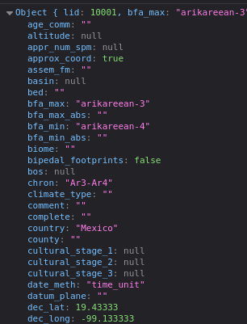
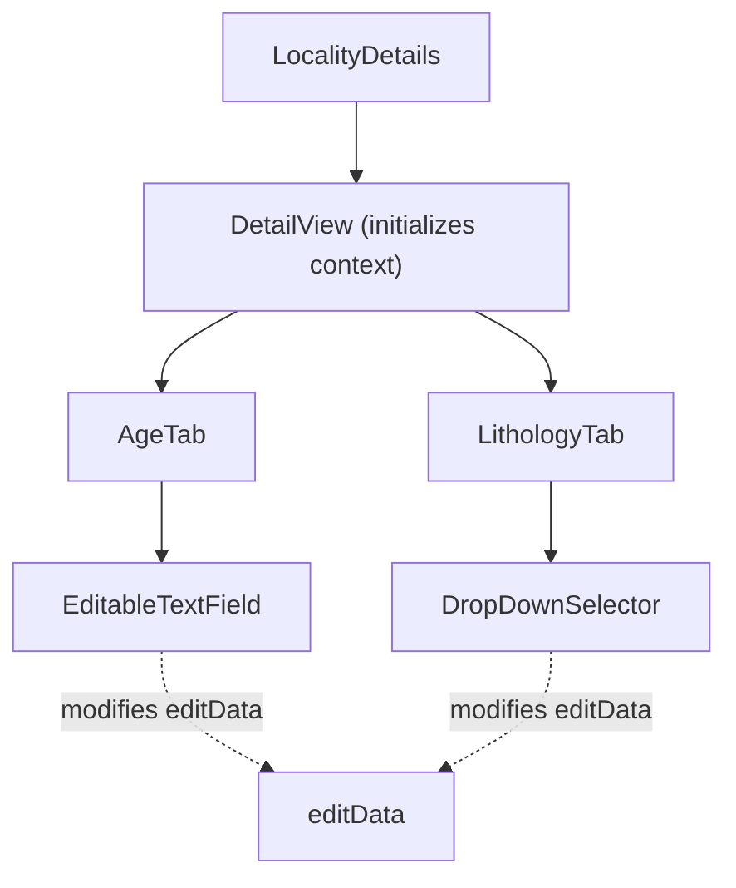
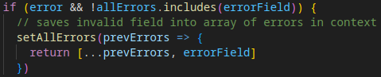

### Frontend explanation

**Data tables**

- [TableView](../../frontend/src/components/TableView/TableView.tsx) is a generic component that takes in column definitions, data, and renders a [material-react-table (click for docs)](https://www.material-react-table.com/). It also handles the tables state management: for example saving column filters into url, and restoring them on first render. Creating a new [tableview](../guides/creating_new_tableview.md) in more detail.

- [DetailView](../../frontend/src/components/DetailView/)-folder has components that are used by the detailed view: The view which allows looking at and editing a single data item, for example a locality. The DetailView-component is generic, allowing different data types to use it.

**Example of a detail view rendering tree**

- [LocalityDetails.tsx](../../frontend/src/components/Locality/LocalityDetails.tsx) queries the data with a RTK Query hook. It then defines tabs, which have a title and a component to render, and gives the tabs and data to a DetailView.

- **DetailView** then handles the state and renders the tabs, providing the tabs the [DetailContext](../../frontend/src/components/DetailView/Context/DetailContext.tsx). This means that the tabs can access the state through the context, and the edited state is preserved even if the tab is changed.

- The tabs are where the actual layout of shown data is defined. The tab, as well as the components that it renders, can use the context to see if user is viewing or editing data. There are some ready hooks and components to display either a data or a component that allows editing the data. See [editingComponents-file](../../frontend/src/components/DetailView/common/editingComponents.tsx). It has components for the commonly used layouts and functionalities. See example for usage in [AgeTab](../../frontend/src/components/Locality/Tabs/AgeTab.tsx). Some important utility components in FormComponents-file:
  - The **DataValue** renders, depending on the mode (reading or editing), the value or a component that allows the user to edit the value.
  - The **ArrayFrame** allows you to write an entire "frame" (a grouping of data within a tab: for example in a Locality > Age tab > Age) as a two-dimensional array, which can contain for example labels or datavalues. See example in AgeTab. This is the best way to write most tabs.

**editData and Context**

Anytime a user edits some data (by typing a value in a text field, selecting a value from a dropdown list...), a corresponding property is edited in `editData`. `editData` is an object that has fields for all the properties of the edited item, and is given by the context. The following image shows a part of the `editData` object for a **locality**:

A **context** is basically the state of a given page. A context is initialized in a DetailView component, which is used in all the detail components (such as LocalityDetails or SpeciesDetails). For example, every LocalityDetails component has a DetailView component inside it, which has its own context, and because of this every tab inside that component can access and modify a single `editData` object. You cannot access the `editData` object of locality X from locality Y, because they are not in the same context.

Example graph:

LocalityDetails has multiple tabs with their own editing components. Because these components belong to the same context, they can access and modify a single `editData` object. In a different LocalityDetails component (or a SpeciesDetails component, etc.) the context and thus the `editData` object will be different.

Because the DetailView is a child component of LocalityDetails, you cannot access the `editData` object from the LocalityDetails component directly. It can only be accessed in child components of the DetailView, such as inside tabs.

The context can also be used to access, for example, the **setEditData** setter, or a validator that can be used to validate data inside an editing component.

**Documentation for validators**

[Validators](../../frontend/src/validators/README.md)

**editingComponents**

If an editingComponent has an error, the `field` value of the component is added to the `allErrors` array in the context. editingComponents have a useEffect hook that runs every time their `error` value changes which either adds or removes them from the `allErrors` array. This array is used to make sure all fields have a proper value before allowing the user to add a new entry (the "Finalize Entry" button is disabled if `allErrors` has anything in it).

Instead of calling the `setAllErrors` function directly with the new array of errors, editingComponents pass an updater function to it.

This ensures that when multiple components try to update the state at the same time, they don't overwrite each other. The react documentation goes into more detail: https://react.dev/reference/react/useState#updating-state-based-on-the-previous-state

**Detailed documentation for editingComponents**

- [RadioSelector](../editingComponents/RadioSelector.md)
- [DropDownSelector](../editingComponents/DropDownSelector.md)
- [FieldWithTableSelection](../editingComponents/FieldWithTableSelection.md)
- [TimeBoundSelection](../editingComponents/TimeBoundSelection.md)
- [EditableTextField](../editingComponents/EditableTextField.md)
