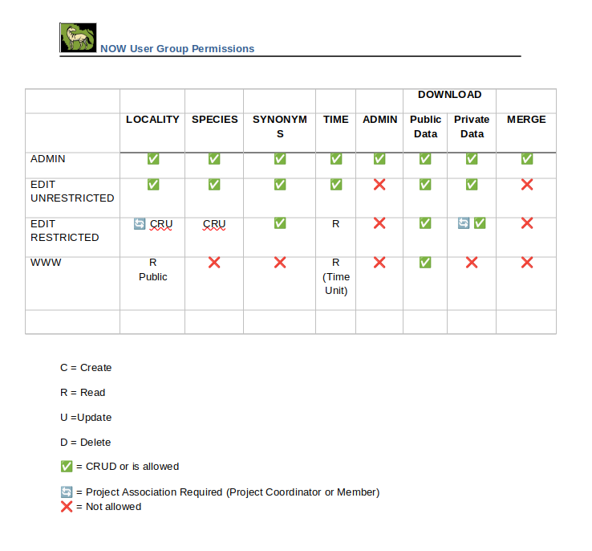

# User Rights

This document shows what each user role can and cannot do.

Previously, there were 7 different user roles:
- Admin (su)
- EditUnrestricted (eu)
- EditRestricted (er)
- Project (pl)
- ProjectPrivate (plp)
- NowOffice (no)
- ReadOnly (ro)

In the new UI platform, there are 4 user roles:
- Admin (su)
- EditUnrestricted (eu)
- EditRestricted (er, pl, plp, no)
- ReadOnly (ro)

Users who have not logged in have the **ReadOnly** role.

The Project, ProjectPrivate, and NowOffice roles exist in the old code but are currently not used. They don't exist at all in the frontend, and in the backend they are only used when assigning roles to test users.
The **EditRestricted** role is also only used in the frontend to show/hide editing buttons, the backend does not use the role in any way.

## Locality

- Any user can obtain a list of localities (private localities are an exception).
- Any user can view the details of a locality (private localities are an exception).
- Creating or updating a locality requires the **Admin**, **EditUnrestricted**, or **EditRestricted** roles.
- Deleting a locality requires the **Admin** or **EditUnrestricted** roles.

NOTE: Users with the **EditRestricted** role should only be able to create or update localities which are in the same project as the user. Otherwise, they have reading rights only.

Current behaviour:
- Users with the **EditRestricted** role can access the edit view in **their own** localities, but sending the PUT request to the backend fails because the role doesn't have permissions.

## Species

- Any user can get a list of species.
- Any user can view the details of a species.
- Creating or updating a species (and synonyms) requires the **Admin**, **EditUnrestricted**, or **EditRestricted** roles.
- Deleting a species requires the **Admin** or **EditUnrestricted** roles.
- Deleting a species synonym requires the **Admin**, **EditUnrestricted**, or **EditRestricted** roles.

Current behaviour:

- Users with the **EditRestricted** role can access the editing/creating new species view from the frontend, but sending the PUT request to the backend fails because the role doesn't have permissions.

## References

- Any user can get a list of References.
- Any user can get a list of Reference types.
- Any user can view the details of a Reference.
- Creating or updating a Reference requires the **Admin**, **EditUnrestricted**, or **EditRestricted** roles.
- Deleting a Reference requires the **Admin** role.

## Time Unit

- Any user can get a list of Time Units.
- Any user can view the details of a Time Unit.
- Creating or updating a Time Unit requires the **Admin** or **EditUnrestricted** roles.
- Deleting a Time Unit requires the **Admin** or **EditUnrestricted** roles.

## Time Bound

- Any user can get a list of Time Bounds.
- Any user can view the details of a Time Bound.
- Creating or updating a Time Bound requires the **Admin** or **EditUnrestricted** roles.
- Deleting a Time Bound requires the **Admin** or **EditUnrestricted** roles.

## Region

- Viewing a list of all Regions requires the **Admin** role.
- Viewing the details of a Region requires the **Admin** role.
- Creating or updating a Region requires the **Admin** role.
- Deleting a Region requires the **Admin** role.

## Person

- Viewing a list of every person requires the **Admin** role.
- Any user can get their information using their ID, but cannot view other people's information (unless they have the **Admin** role)

## Project

- Any user can get a list of Projects.
- Viewing project details requires the **Admin** role.
- Creating or updating a Project requires the **Admin** role.
- Deleting a Project requires the **Admin** role.

## Museum

- Any user can get a list of museums.
- Any user can view the details of a Museum.
- Creating or updating a Museum requires the **Admin**, **EditUnrestricted**, or **EditRestricted** roles.

## Sedimentary Structure

- Any user can get a list of sedimentary structures.

## Email

- Any user can send an email

## User Rights Table

| User group       | Locality | Species | References | Time Units | Time Bounds | Regions | Persons | Projects | Museums | Sedimentary Structures | Sending Email |
| ---------------- | -------- | ------- | ---------- | ---------- | ----------- | ------- | ------- | -------- | ------- | ---------------------- | ------------- |
| Admin            | ALL      | ALL     | ALL        | ALL        | ALL         | ALL     | ALL     | ALL      | ALL     | ALL                    | C             |
| EditUnRestricted | ALL      | ALL     | ALL        | ALL        | ALL         | X       | X\*\*\* | R\*\*    | ALL     | ALL                    | C             |
| EditRestricted   | CRU      | CRU     | CRU        | R          | R           | X       | X\*\*\* | R\*\*    | R       | R                      | C             |
| ReadOnly         | R        | R       | R          | R          | R           | X       | X\*\*\* | R\*\*    | R       | R                      | C             |

C = Create

R = Read

U = Update

D = Delete

X = No rights

ALL = All rights

\* = Requires a Project association

\*\* = Any user can view a list of projects, but viewing the details of a project requires the **Admin** role.

\*\*\* = Users can only get their information.

Below is a matrix showing the user rights. Not all of these are implemented yet.

