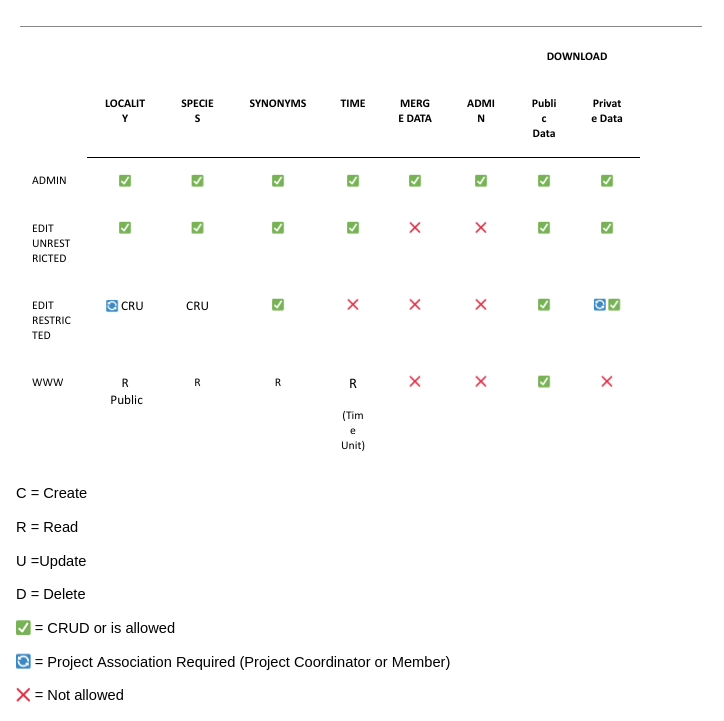

### User Rights

There are 7 different user roles:

- su: Role.Admin,
- eu: Role.EditUnrestricted,
- er: Role.EditRestricted,
- pl: Role.Project,
- plp: Role.ProjectPrivate,
- no: Role.NowOffice,
- ro: Role.ReadOnly,

Visitors that have not logged in do not have a role.

The following matrix shows broadly what different user roles can or cannot do:

